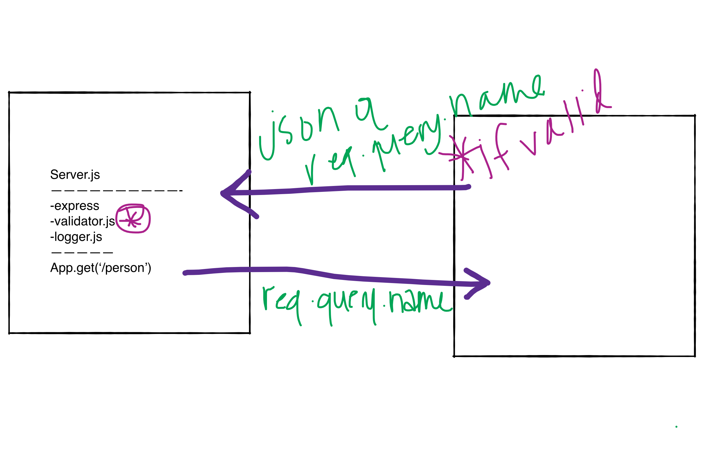

# Lab 02:
# basic-express-server

Basic express server created with focus on modularized code and use of route and app level middleware.

## Links & Resources
[Pull Requests](https://github.com/thornrae/basic-express-server/pull/2)

[ci/cd](https://github.com/thornrae/basic-express-server/actions)

[Heroku Deployment](https://basic-express-server-401.heroku.app)

## Set Up
PORT=3000

## Initialize
npm i express jest supertest

### Needed
Node.js, JavaScript, Express, Jest

### Change Log
2-24-2021 --> server built, app level middleware, passing route tests
2-25-2021 -->  functional route level middleware

### UML

